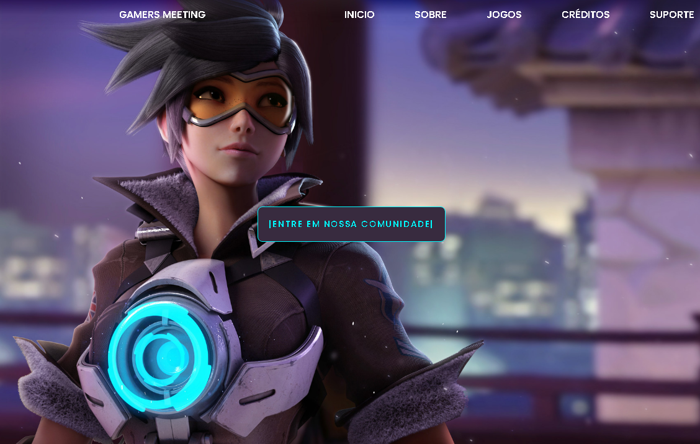

# Gamers Meeting

----

Projeto desenvolvido para entrega do TCC, onde o site se constitui em conectar a comunidade interessada em jogos a comunidade do seu próprio jogo.

Este projeto também contou com a participação deles: 

- Carlos Eduardo
- Larissa Alexandra
- Felipe Alexandre
- Cauã Arruda

Desenvolvido com: 

- HTML
- CSS
- JavaScript